# Arduino Neural Network Weight Compression Experiment  
アジャイルワーク2（行列データ圧縮実験）– Script Directory

本 README は、本実験を「再現可能」にするために必要な **script ディレクトリの内容のみ** をドキュメント化したものです。  
カラーセンサスキャナを用いた RGB 測定、ニューラルネットワークの推論、および重み圧縮（プルーニング + CSR）に関する実装がすべて含まれています。

---

## 📂 Directory Structure (`script/`)
script
├── mse_calculator.html        
├── newScanner
│   ├── convertCSR.py           
│   ├── model_parameters_csr.h  Arduino用）
│   ├── model_parameters.h      
│   └── newScanner.ino        
├── oldScanner
│   ├── model_parameters.h      
│   └── oldScanner.ino          
├── results
│   ├── correct
│   │   ├── correct_result.ppm
│   │   ├── no_rev_result1-1.ppm
│   │   ├── no_rev_result2-1.ppm
│   │   └── reference_image1.ppm
│   └── ex_results
│       ├── layer40-2.ppm
│       ├── layer40.ppm
│       ├── layer60.ppm
│       └── origin.ppm
├── scanner
│   └── convertCSR.py           
├── scanner.c                   
└── train_python
├── img
│   ├── reference_image1_cmyk_large.png
│   └── reference_image2_cmyk_large.png
├── model_parameters.h      
├── requirements.txt
└── train_L1_normalization.ipynb  

---

## 🔍 **各ディレクトリ・ファイルの役割**

### 1. **newScanner/**
CSR圧縮方式（プルーニング + CSR）を用いた **実験の中心ディレクトリ**

| ファイル名 | 役割 |
|-----------|------|
| `newScanner.ino` | Arduino 上で RGB を測定し、NN 推論を実行するメインプログラム |
| `model_parameters.h` | 非圧縮の学習済み重み |
| `model_parameters_csr.h` | CSR 形式で圧縮済みの重み（PROGMEM対応） |
| `convertCSR.py` | Pythonで重みをCSR形式に変換して出力するスクリプト |

このフォルダだけで、**圧縮あり/なし NN の比較実験をそのまま実行可能**。

---

### 2. **oldScanner/**
圧縮方式導入前のスキャナ。  

新旧の比較実験のために残されているコード。

---

### 3. **results/**
実験で生成した PPM 画像の保存先。

- `correct/`  
  正解画像、非圧縮モデルの結果画像などが格納。

- `ex_results/`  
  隠れ層40・60・複数パターンの推論結果を保存。  
  MSE 評価や圧縮効果の検証に用いる。

---

### 4. **train_python/**
Python による NN の学習・重み生成のための環境。

| ファイル | 説明 |
|---------|------|
| `train_L1_normalization.ipynb` | L1 正規化を用いた学習ノートブック |
| `model_parameters.h` | 学習後に生成される C 言語形式の重み |
| `requirements.txt` | Python 依存パッケージ |
| `img/` | 学習のための基準画像 |

NN の再学習が必要な場合は、このフォルダのみで完結。

---

### 5. **scanner/** & `scanner.c`
旧版の CSR 変換スクリプトおよび C 実装の補助コード。  
再現性には直接必要ではないが、実験過程の履歴として残されている。

---

### 6. **mse_calculator.html**
ブラウザ上で PPM 画像を比較し、**MSE を自動計算**できる便利ツール。  
実験レポート作成時の評価に使用。

---

##  **再現手順**
### 非圧縮方式の実験手順

```mermaid
flowchart TD
    Start([実験開始:<br/>方式A 圧縮なし非プルーニング方式]) --> Step1

    subgraph Phase1[フェーズ1: 初期準備]
        Step1[Pythonノートブック実行<br/>train_L1_normalization.ipynb]
        Step1 --> Step2[学習済み重みデータ生成<br/>model_parameters.h]
        Step2 --> Step3{重みデータ検証<br/>正常に生成?}
        Step3 -->|No| Step1
        Step3 -->|Yes| Step4[重みデータ確定<br/>方式A・B共通使用]
    end

    Step4 --> Phase2Start

    subgraph Phase2[フェーズ2: Arduinoプログラム設定]
        Phase2Start[Arduinoプログラム選択]
        Phase2Start --> Step5{スキャナ選択}
        Step5 -->|新型| Step6A[newScanner.ino]
        Step5 -->|旧型| Step6B[oldScanner.ino]
        Step6A --> Step7[model_parameters.h を<br/>非圧縮のままinclude]
        Step6B --> Step7
        Step7 --> Step8[非圧縮NNを搭載<br/>コンパイル実行]
        Step8 --> Step9{コンパイル<br/>成功?}
        Step9 -->|No| Step8
        Step9 -->|Yes| Step10[メモリ使用量記録<br/>Flash/SRAM確認]
    end

    Step10 --> Phase3Start

    subgraph Phase3[フェーズ3: RGB測定と推論]
        Phase3Start[カラーセンサスキャナ準備]
        Phase3Start --> Step11{画像サイズ選択}
        Step11 -->|3×3| Step12A[3×3画像読み取り]
        Step11 -->|6×6| Step12B[6×6画像読み取り]
        Step12A --> Step13[millis 開始時刻記録]
        Step12B --> Step13
        Step13 --> Step14[Arduino NN推論実行<br/>predict関数呼び出し]
        Step14 --> Step15[millis 終了時刻記録<br/>実行時間計算]
        Step15 --> Step16[各画素の推論RGB出力<br/>シリアル通信でPC送信]
        Step16 --> Step17[PCでPPM画像生成]
    end

    Step17 --> Phase4Start

    subgraph Phase4[フェーズ4: 評価・分析]
        Phase4Start[評価データ収集]
        Phase4Start --> Step18[元画像と推論画像の<br/>MSE計算]
        Step18 --> Step19[メモリ使用量分析<br/>Flash/SRAM使用率]
        Step19 --> Step20[実行速度分析<br/>predict関数の処理時間]
        Step20 --> Step21[評価結果まとめ<br/>・MSE値<br/>・メモリ使用量<br/>・推論速度]
    end

    Step21 --> Phase5Start

    subgraph Phase5[フェーズ5: 実験完了]
        Phase5Start[結果整理]
        Phase5Start --> Step22[方式B比較用に<br/>データフォーマット統一]
        Step22 --> Step23[実験レポート作成<br/>・精度評価<br/>・リソース評価<br/>・速度評価]
    end

    Step23 --> End([実験終了<br/>方式Bとの比較準備完了])

    style Start fill:#e1f5e1
    style End fill:#ffe1e1
    style Phase1 fill:#f0f8ff
    style Phase2 fill:#fff8e1
    style Phase3 fill:#f3e5f5
    style Phase4 fill:#e8f5e9
    style Phase5 fill:#fce4ec
    style Step3 fill:#fff3cd
    style Step5 fill:#fff3cd
    style Step9 fill:#fff3cd
    style Step11 fill:#fff3cd
```

##  実験の目的（script で再現可能な範囲）

- Arduino で動作する NN の隠れ層次元を拡張（40 → 80）  
- 圧縮なしではメモリ不足 → CSR圧縮により**メモリ削減**を実現  
- 出力画像の MSE を比較し、**推論品質への影響を測定**  
- predict の実行速度（ms）を Arduino で計測  

---

